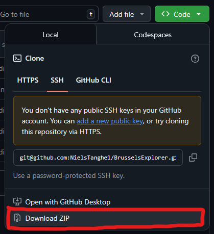
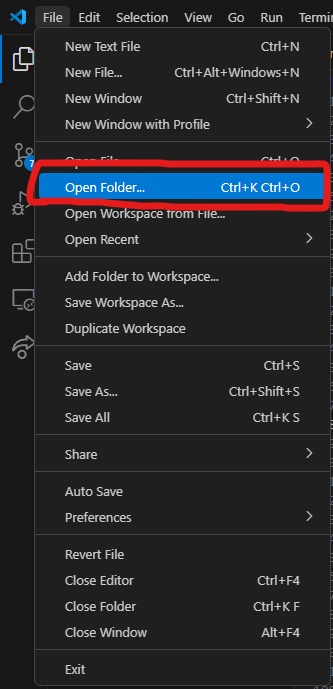
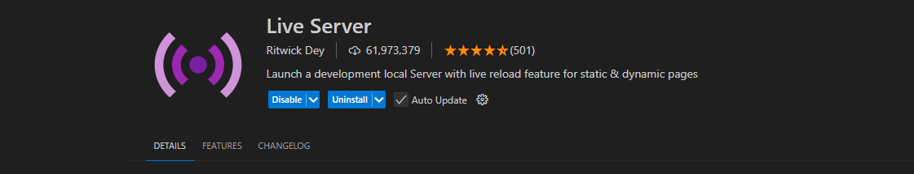
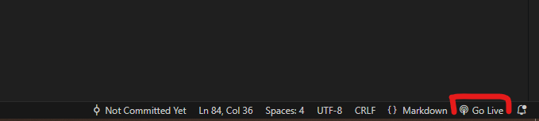

# BrusselsExplorer

Group work for the subject Dynamic Web.
Making a website where you can find toilets in Brussel, sort, save...

## Used datasets

**OpenData.Brussels**:

1. [Public toilets](https://opendata.brussels.be/explore/dataset/toilettes_publiques_vbx/information/?disjunctive.status&disjunctive.openinghours&disjunctive.management_en)
2. [Public urinals](https://opendata.brussels.be/explore/dataset/urinoirs-publics-vbx/information/)
3. [Dog toilets](https://opendata.brussels.be/explore/dataset/bruxelles_canisite/information/?disjunctive.postalcode&disjunctive.territory_fr)
4. [Public parks](https://opendata.brussels.be/explore/dataset/parcs_et_jardins_publics/information/)

**Google:**

1. Google maps API (met datasets van de Brussel API op upgeload)

## Technical requirements

**DOM manipulation:**

- Select elements
**Code example:** Get user input (search terms, add to favourites, filters, sorting...).

- Manipulate elements
**Code example:** Saving favourites, show search results, adjust the theme when requested...

- Connect events to elements
**Code example:** Favourites buttons, search button, side menu open/close, adjust theme and language...

---

**Modern JavaScript:**

- Using Constants
**Code example:** We retrieve all buttons and divs that don't change as constants at the beginning of our code.

- Template Literals
**Code example:** To automatically assign unique IDs to certain HTML elements (each favourite div has a unique ID linked to its content).

- Iterating over arrays
**Code example:** To read the datasets and display them in a table. To display user favourites in a list.

- Array methods
**Code example:** Search function and sorting of results.

- Arrow functions
**Code example:** To create functions in event listeners.

- Conditional (ternary) operator (modern if..else)
**Code example:** To switch between states in objects (free or not, visible or not...).

- Callback functions
**Code example:** /

- Promises
**Code example:** When fetching API data.

- Async & Await
**Code example:** To only do things with the data once it has been loaded.

- Observer API (1 is sufficient)
**Code example:** /

---

**Data & API:**

- Fetch to retrieve data
**Code example:** Brussels API.

- Manipulate and display JSON
**Code example:** Maintain, store, update, and read favourites and user data.

---

**Storage & Validation:**

- Form Validation
**Code example**: Catch invalid input in search. If location access is denied, restrict access to certain items to prevent errors.

- Using Local-storage
**Code example**: Favourites and locations are all stored in an object in local (browser) storage.

---

**Styling & layout:**

- Basic HTML layout (flexbox or CSS grid can be used)
- Basic CSS
- User-friendly elements (delete buttons, icons, etc.)

## Installation manual

1. Download the .zip file from this GitHub repository.

2. Extract the .zip file to a folder and open it via VS Code

3. Install the live server plugin in VS Code

4. Start the live server at the bottom of your VS Code window

## Sources used

**Generally:**

1. [OpenData.Brussels](https://opendata.brussels.be)
2. [StackOverflow](https://www.stackoverflow.com)
3. [W3School](https://www.w3schools.com/)
4. [Google](https://www.google.com)
5. [Cursus Dynamic Web](https://canvas.ehb.be/courses/38344)

**StackOverflow:**

1. [Latitude or longitude to meters](https://stackoverflow.com/questions/639695/how-to-convert-latitude-or-longitude-to-meters)

## Division of tasks

### Bruno

- HTML structure
- JS favourites
- CSS styling
- Search function
- Sorting

### Niels

- JS calculate distance
- CSS styling
- README
- Filters
- Bar charts
